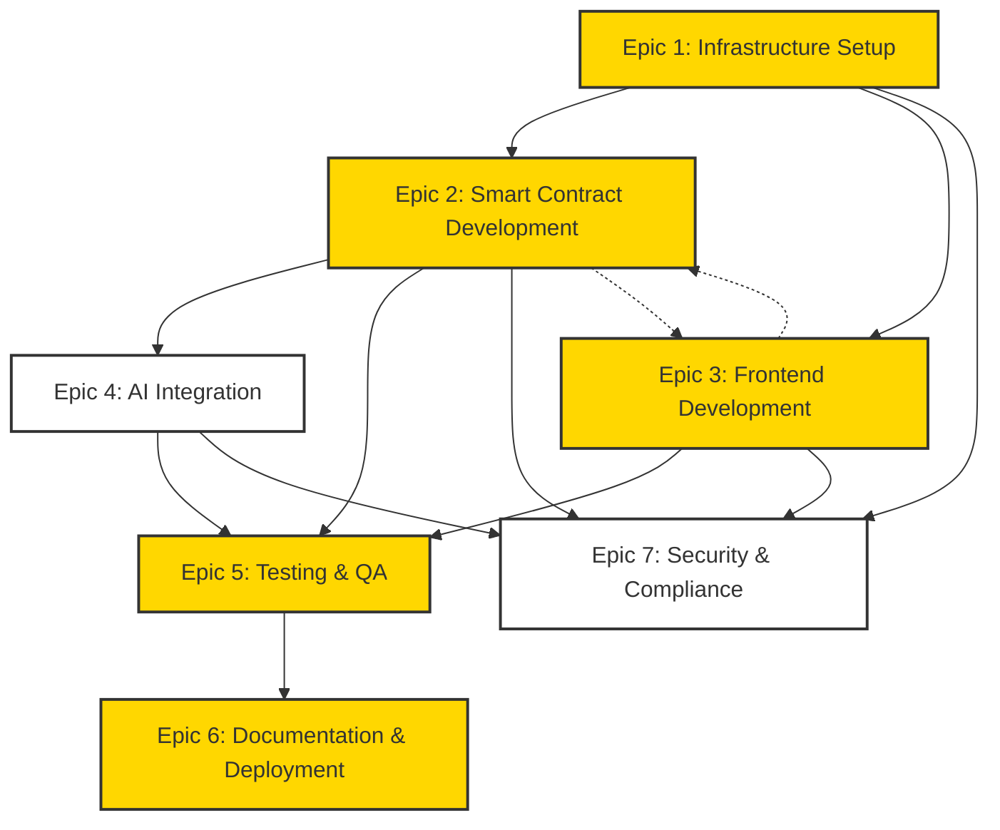

# OVT Development Backlog

## Status & Priority Legend
- Status: 🔴 Not Started | 🟡 In Progress | 🟢 Completed | ⭕ Blocked | 🔵 In Review
- Priority: 🏃‍♂️ P0 (Critical) | 🚶‍♂️ P1 (High) | 🧍‍♂️ P2 (Medium) | 🪑 P3 (Low)

## Dependency Graph

## Epic 1: Infrastructure Setup 🟡
Foundation for development environment and tooling.

### Tasks
1. 🟢 Install and configure development prerequisites 🏃‍♂️
   - [x] Node.js and npm
   - [x] Rust and Cargo
   - [x] PowerShell configuration
   - [x] Git and GitHub setup

2. 🟢 Set up development environment 🏃‍♂️
   - [x] Configure project structure
   - [x] Initialize Git repository
   - [x] Set up GitHub organization repository
   - [x] Set up CI/CD pipeline

3. 🟡 Configure Arch Network tools 🏃‍♂️
   - [x] Install Bitcoin Core in regtest mode
   - [x] Configure and run Electrs indexer
   - [x] Set up local validator
   - [x] Configure project structure according to Arch Network guide
   - [x] Configure testnet connection
   - [x] Implement deployment scripts

## Epic 2: Smart Contract Development 🟡
Core OVT program implementation on Arch Network.

### Tasks
1. 🟢 Core OVT Program Structure 🏃‍♂️
   - [x] Set up program modules
   - [x] Implement error handling
   - [x] Add program state management
   - [x] Implement instruction processing
   - [x] Add transaction verification logic
   - [x] Implement proof validation system
   - [x] Implement mock SDK for testing
   - [x] Implement proper account management
   - [x] Fix code organization and warnings
   - [x] Implement proper process_instruction handling in mock SDK
   - [x] Fix BorshDeserialize trait imports in mock SDK

2. 🟢 NAV Calculation System 🏃‍♂️
   - [x] Implement price feed integration
   - [x] Create NAV calculation logic
   - [x] Add portfolio valuation logic
   - [x] Implement treasury tracking
   - [x] Add NAV validation rules

3. 🟡 NAV Automation 🏃‍♂️
   - [ ] Implement automated oracle price feed integration
     - [ ] Set up price feed for WBTC
     - [ ] Set up price feed for WETH
     - [ ] Set up price feed for OTORI tokens
   - [ ] Create automated treasury holdings calculation
     - [ ] Implement UTXO scanning and tracking
     - [ ] Add balance aggregation logic
     - [ ] Implement real-time updates
   - [ ] Add SAFT valuation system
     - [ ] Create SAFT state management
     - [ ] Implement funding round tracking
     - [ ] Add automated valuation updates
   - [ ] Implement automated NAV updates
     - [ ] Create update trigger system
     - [ ] Add validation and verification
     - [ ] Implement error recovery
   - [ ] Add comprehensive monitoring
     - [ ] Price feed health checks
     - [ ] Treasury balance monitoring
     - [ ] NAV calculation verification
     - [ ] Alert system for anomalies

4. 🟢 Token Operations 🚶‍♂️
   - [x] Implement OVT minting with 3/5 multisig
   - [x] Add transfer functionality
   - [x] Create buyback mechanism
   - [x] Implement burn functionality
   - [x] Add supply validation rules

5. 🟡 RPC Client Features 🏃‍♂️
   - [x] Implement transaction history & indexing
   - [x] Add fee estimation & UTXO management
   - [x] Add network status & health monitoring
   - [x] Implement event subscription system
   - [x] Add caching layer with TTL
   - [x] Implement rate limiting
   - [x] Add retry logic with backoff
   - [x] Enforce "OTORI VISION TOKEN" symbol
   - [ ] Add performance monitoring
     - [ ] Request latency tracking
     - [ ] Cache hit ratio monitoring
     - [ ] Rate limit violation tracking
   - [ ] Optimize caching strategy
     - [ ] Implement cache invalidation
     - [ ] Add cache warmingm
     - [ ] Create cache size limits
   - [x] Enhance error handling
     - [x] Add detailed error reporting
     - [x] Implement circuit breaker
     - [x] Create error recovery strategies

6. ⭕ Oracle Integration 🚶‍♂️
   - [ ] Set up price feed oracles
   - [ ] Implement data validation
   - [ ] Add fallback mechanisms
   - [ ] Create update mechanisms

7. 🔴 Multi-Currency Position Support 🚶‍♂️
   - [ ] USD Stablecoin Integration
     - [ ] Add stablecoin price feed integration
     - [ ] Implement stablecoin-to-BTC conversion
     - [ ] Add validation for stablecoin transactions
     - [ ] Create stablecoin position tracking
   - [ ] Position Management Updates
     - [ ] Update position entry UI for multiple currencies
     - [ ] Add currency conversion handling
     - [ ] Implement position value tracking in multiple currencies
     - [ ] Create currency-specific validation rules
   - [ ] NAV Calculation Enhancementsm
     - [ ] Maintain consistent interfaces
   - [ ] Implement gradual migration strategy
     - [ ] Keep mock data as fallback
     - [ ] Add feature flags for rollout
     - [ ] Implement comprehensive error handling
     - [ ] Add proper logging system

2. **Network Operations Handling** 🏃‍♂️
   - [ ] Implement robust error handling
     - [ ] Add retry mechanisms with backoff
     - [ ] Implement circuit breaker pattern
     - [ ] Add proper error boundaries
     - [ ] Create fallback UI states
   - [ ] Enhance state management
     - [ ] Add loading states
     - [ ] Implement optimistic updates
     - [ ] Add error states and recovery

3. **Monitoring Infrastructure** 🚶‍♂️
   - [ ] Performance metrics
     - [ ] API response times
     - [ ] Transaction processing
     - [ ] WebSocket status
     - [ ] Cache performance
   - [ ] Error metrics
     - [ ] Failed transactions
     - [ ] Network errors
     - [ ] API errors
     - [ ] State inconsistencies
   - [ ] Business metrics
     - [ ] NAV calculation accuracy
     - [ ] Portfolio updates
     - [ ] Transaction success rates

4. **Security Implementation** 🏃‍♂️
   - [ ] Implementation security
     - [ ] Key management
     - [ ] Environment variables
     - [ ] Input validation
     - [ ] Rate limiting
   - [ ] Network security
     - [ ] SSL/TLS configuration
     - [ ] API authentication
     - [ ] Request validation
     - [ ] CORS configuration

## Epic 2.5: Network Integration 🟡
Implementation of Arch Network integration and transition from mock environment.

### Tasks
1. 🟡 Bitcoin Network Connection 🏃‍♂️
   - [x] Deploy and configure Bitcoin Core node
   - [x] Set up Electrs indexer
   - [x] Implement RPC client integration
   - [x] Add UTXO tracking system
   - [x] Implement confirmation monitoring
   - [x] Handle chain reorganizations
   - [x] Add proper error handling

2. 🟡 Arch Network Integration 🏃‍♂️
   - [ ] Convert mock program to Arch Network format
   - [x] Add comprehensive error handling with Arch types
   - [x] Fix mock SDK import issues and conflicting implementations
   - [x] Fix type conflicts in mock SDK implementation
   - [ ] Deploy to testnet environment
   - [ ] Implement state transition validation
   - [ ] Add comprehensive error handling
   - [ ] Set up proper monitoring
   - [ ] Create rollback procedures

3. 🟡 State Management 🚶‍♂️
   - [ ] Design state migration strategy
   - [ ] Implement data validation system
   - [ ] Set up monitoring and alerts
   - [ ] Create state recovery procedures
   - [ ] Add performance monitoring
   - [ ] Implement caching layer

4. 🟡 Security Implementation 🏃‍♂️
   - [x] Set up secure RPC connections
   - [x] Implement key management system
   - [x] Add multi-signature support
   - [ ] Create backup procedures
   - [ ] Implement monitoring systems
   - [ ] Add security audit logging

5. 🟡 Testing Infrastructure 🚶‍♂️
   - [x] Set up testnet environment
   - [x] Create integration test suite
   - [ ] Implement load testing
   - [ ] Add performance benchmarks
   - [ ] Create security test suite
   - [ ] Add automated monitoring tests

## Completed Tasks ✅
- [x] Convert mock SDK to use Arch Network primitives
- [x] Implement proper UTXO validation and handling
- [x] Add comprehensive error handling with Arch types
- [ ] Update program entry point for Arch Network
- [ ] Add rent calculation and validation
- [x] Enhance admin verification using Arch's system
- [x] Update transaction handling for Bitcoin network
- [x] Fix mock SDK import issues and conflicting implementations
- [x] Implement circuit breaker pattern in RPC client
- [x] Add retry logic with proper error handling in RPC client
- [x] Fix Bitcoin RPC test compatibility issues
- [x] Resolve type conflicts in mock SDK implementation
- [x] Fix AccountInfo Clone implementation

## In Progress 🚧
- [🟡] Complete UTXO tracking system
- [ ] Implement confirmation monitoring
- [ ] Handle chain reorganizations
- [ ] Set up monitoring infrastructure
- [ ] Create deployment verification tests

## Epic 3: Frontend Development 🟢
User interface and interaction layer.

### Tasks
1. 🟢 Project Setup 🏃‍♂️
   - [x] Initialize Next.js project
   - [x] Configure TypeScript
   - [x] Set up Tailwind CSS
   - [x] Add required dependencies

2. 🟢 Core Components 🏃‍♂️
   - [x] Create NAV visualization
   - [x] Implement wallet connector
   - [x] Add portfolio view
   - [x] Create transaction history

3. 🟢 State Management 🚶‍♂️
   - [x] Implement OVT state hooks
   - [x] Add wallet state management
   - [x] Create transaction state handling
   - [x] Implement error state management

4. 🟢 Admin Dashboard 🏃‍♂️
   - [x] Create admin authentication with multisig
   - [x] Implement token minting interface
   - [x] Create portfolio management interface
   - [x] Implement position tracking

5. 🟡 Data Integration 🚶‍♂️
   - [x] Implement mock data integration
   - [ ] Connect to Arch Network
   - [ ] Implement real-time updates
   - [ ] Add transaction handling
   - [x] Create error handling

## Epic 4: AI Integration 🔴
AI-driven portfolio management system.

### Tasks
1. 🔴 Model Infrastructure 🧍‍♂️
   - [ ] Set up AI model environment
   - [ ] Implement data processing pipeline
   - [ ] Create model versioning system
   - [ ] Add monitoring tools

2. 🔴 Portfolio Analysis 🧍‍♂️
   - [ ] Implement market trend analysis
   - [ ] Create risk assessment system
   - [ ] Add performance metrics
   - [ ] Implement decision validation

3. 🔴 Integration Layer 🚶‍♂️
   - [ ] Create API endpoints
   - [ ] Implement proof generation
   - [ ] Add verification system
   - [ ] Create fallback mechanisms

## Epic 5: Testing & Quality Assurance 🟡
Comprehensive testing strategy implementation.

### Tasks
1. 🟢 Unit Testing 🏃‍♂️
   - [x] Set up testing framework
   - [x] Configure Jest with Next.js
   - [x] Add initial component tests
   - [x] Implement mock SDK tests
   - [x] Add UTXO handling tests
   - [x] Add Bitcoin transaction tests
   - [x] Complete frontend component test coverage:
     - [x] NAVVisualization component
     - [x] PositionManagement component
     - [x] TransactionHistory component
     - [x] Portfolio components
     - [x] Admin dashboard components
     - [x] Wallet connection components
   - [x] Add state management tests:
     - [x] OVT state hooks
     - [x] Wallet state
     - [x] Transaction state
     - [x] Error state

2. 🟢 CI/CD Pipeline 🏃‍♂️
   - [x] Set up GitHub Actions
   - [x] Configure dependency checks
   - [x] Add security scanning
   - [x] Implement automated testing
   - [x] Add bundle size analysis

3. 🟢 Code Quality 🏃‍♂️
   - [x] Set up branch protection rules
   - [x] Configure CODEOWNERS
   - [x] Implement code review process
   - [x] Add automated dependency updates
   - [x] Configure test requirements for PRs

4. 🟡 Integration Testing 🚶‍♂️
   - [x] Mock SDK integration tests
   - [x] UTXO state transition tests
   - [x] Bitcoin transaction handling tests
   - [ ] Frontend integration tests:
     - [ ] API integration tests
     - [ ] State management integration
     - [ ] Component interaction tests
     - [ ] Error handling integration

5. 🔴 End-to-End Testing 🚶‍♂️
   - [ ] User journey tests:
     - [ ] Portfolio management flow
     - [ ] Admin operations flow
     - [ ] Token operations flow
   - [ ] Error scenario testing:
     - [ ] Network error handling
     - [ ] Transaction failure recovery
     - [ ] State inconsistency handling
   - [ ] Performance testing:
     - [ ] Load testing
     - [ ] Response time benchmarks
     - [ ] State update performance

6. 🟡 Testing Infrastructure 🏃‍♂️
   - [x] Set up Jest with Next.js configuration
   - [x] Configure test environment
   - [x] Add test utilities and mocks
   - [x] Implement mock SDK
   - [x] Frontend test environment:
     - [x] Add missing testing dependencies
     - [x] Configure TypeScript types for testing
     - [x] Set up testing utilities
     - [x] Add component test helpers

7. 🟡 Security Implementation 🚶‍♂️
   - [x] Set up testing framework
   - [x] Configure Jest with Next.js
   - [ ] Remove mock data population functionality before mainnet
     - [ ] Remove populate-positions script
     - [ ] Remove mock data loading from useOVTClient
     - [ ] Update documentation to reflect production-only functionality
   - [ ] Add comprehensive test coverage for production endpoints

## Epic 6: Documentation & Deployment 🟢
Documentation and deployment procedures.

### Tasks
1. 🟢 Technical Documentation 🚶‍♂️
   - [x] Create README
   - [x] Add installation guide
   - [x] Document API endpoints
   - [x] Create troubleshooting guide
   - [x] Document dependency management

2. 🟢 Development Process 🧍‍♂️
   - [x] Create user journey docs
   - [x] Document git workflow
   - [x] Add team structure
   - [x] Define review process
   - [x] Set up automated updates

3. 🟡 Deployment Procedures 🏃‍♂️
   - [x] Create deployment checklist
   - [x] Set up CI/CD pipeline
   - [ ] Document rollback procedures
   - [ ] Add monitoring setup
   - [ ] Create maintenance guide

## Epic 7: Security & Compliance 🔴
Security implementation and compliance measures.

### Tasks
1. 🔴 Security Implementation 🏃‍♂️
   - [ ] Implement input validation
   - [ ] Add transaction signing
   - [ ] Create access controls
   - [ ] Implement rate limiting

2. 🔴 Audit Preparation 🚶‍♂️
   - [ ] Document security measures
   - [ ] Create audit checklist
   - [ ] Prepare technical documentation
   - [ ] Set up security monitoring

3. 🔴 Compliance Framework 🧍‍♂️
   - [ ] Document regulatory requirements
   - [ ] Implement KYC/AML checks
   - [ ] Create compliance reports
   - [ ] Add audit logging

## Completed Tasks ✅
- [x] Implement NAV validation with 4000% maximum change threshold
- [x] Fix RefCell sharing in mock SDK for proper state persistence
- [x] Add comprehensive test coverage for NAV updates
- [x] Implement proper error handling for invalid NAV changes
- [x] Document RefCell fixes and learnings in DEV_JOURNAL
- [x] Fix test suite reliability issues
- [x] Set up CI/CD pipeline with GitHub Actions
- [x] Implement initial frontend components with mock data
- [x] Configure development environment for Arch Network
- [x] Set up Jest configuration for Next.js
- [x] Add UTXO handling and Bitcoin transaction tests
- [x] Implement NAVVisualization component tests
- [x] Implement PositionManagement component tests
- [x] Add numeric handling improvements for currency inputs
- [x] Implement proper form validation with error handling
- [x] Add currency conversion and formatting functionality
- [x] Implement TransactionHistory component tests with proper async handling
- [x] Add comprehensive test coverage for transaction filtering and formatting
- [x] Improve test reliability with proper act() wrapping and regex patterns

## In Progress 🚧
- [ ] Complete frontend component test coverage
- [ ] Implement frontend integration tests
- [ ] Set up end-to-end testing infrastructure
- [ ] Add frontend test utilities and helpers
- [ ] Configure TypeScript types for testing
- [ ] Set up integration with Arch Network testnet

## Upcoming Tasks 📋
- [ ] Implement user journey tests
- [ ] Add performance benchmarks
- [ ] Set up error scenario testing
- [ ] Create component interaction tests
- [ ] Implement API integration tests

## Future Considerations 🔮
- [ ] Plan mainnet deployment strategy
- [ ] Implement automated performance testing
- [ ] Design scaling solutions
- [ ] Enhance security measures
- [ ] Prepare for security audit

## Notes
- This backlog is automatically updated as tasks are completed
- Priority may shift based on Arch Network development status
- Tasks may be added or modified based on technical requirements
- Dependencies between epics should be considered when planning

## Task Update Process
1. Update task status using emoji indicators
2. Add new tasks as needed under appropriate epics
3. Document completion dates for major milestones
4. Track dependencies and blockers

## Priority Guidelines
- 🏃‍♂️ P0 (Critical): Blocking tasks that must be completed for core functionality
- 🚶‍♂️ P1 (High): Important features needed for MVP
- 🧍‍♂️ P2 (Medium): Nice-to-have features that improve UX
- 🪑 P3 (Low): Future enhancements and optimizations 